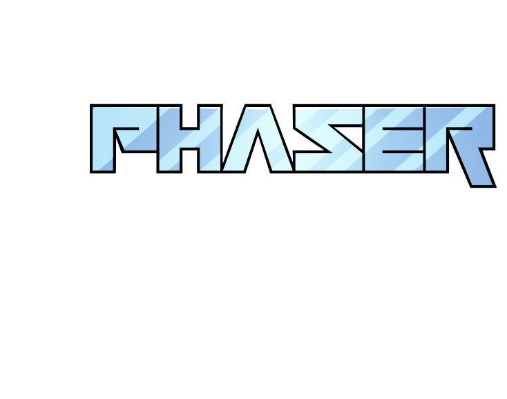
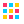

# ⬟ PROJECT NEMESIS — Landing Page

[](https://developer.mozilla.org/en-US/docs/Web/HTML)
[](https://developer.mozilla.org/en-US/docs/Web/CSS)
[](https://developer.mozilla.org/en-US/docs/Web/JavaScript)
[](https://phaser.io/)
[](https://vitejs.dev/)
[](https://vercel.com/)
[]()
<br>

> **_"Aprende. Adapta. Domina."_** — Landing page informacional para **_Project Nemesis_**, un juego de lucha 2D con IA adaptativa. Inspirado en el estilo visual de [loophero.com](https://loophero.com).

---

## ✨ Características

| # | Sección | Descripción |
|---|---------|-------------|
| 01 | **Hero** | Partículas animadas + título pixel-art + CTA |
| 02 | **Play** | Demo embebida del juego (iframe) |
| 03 | **Story** | Lore del juego con imagen lateral |
| 04 | **Characters** | Showcase de personajes con tabs animados |
| 05 | **Technical Features** | Cards con Material Icons (IA, Data-Driven, etc.) |
| 06 | **Technologies & Tools** | SVGs originales de Phaser, Vite, JS, Node.js, etc. |
| 07 | **Algorithms** | Acordeón explicando los 10 subsistemas de IA |
| 08 | **Development Status** | Mapa radial tipo estrella con estado de cada módulo |
| 09 | **Character Gallery** | Tabs + lightbox con sprites pixel-art |
| 10 | **Roadmap** | Timeline zigzag con milestones |
| 11 | **Changelog** | Acordeón en grid con historial de versiones |
| 12 | **Trivia** | Quiz interactivo de 10 preguntas con corrección |
| 13 | **Community & Social** | Enlaces a GitHub, Twitter/X, Email |

### 🌐 Internacionalización
- **ES / EN** completo con toggle guardado en `localStorage`
- Traducciones para texto estático (`data-i18n`) y contenido dinámico (secciones renderizadas por JS)

### 🎨 Tema oscuro / claro
- Switch minimalista con Material Icons (`dark_mode` / `light_mode`)
- Persistencia en `localStorage` (default: dark)
- Transiciones suaves mediante CSS custom properties

---

## 🧰 Stack Tecnológico

```
┌─────────────────────────────────────────────────────┐
│  Frontend        HTML5 + CSS3 + JavaScript (Vanilla) │
│  Fuente          Press Start 2P (Google Fonts)      │
│  Iconos          Material Icons + SVGs custom        │
│  Juego           Phaser 4.1.0 (iframe embebido)     │
│  Build (juego)   Vite                               │
│  Deploy          Vercel (static SPA)                │
│  Persistencia    localStorage (tema + idioma)       │
│  Animaciones     CSS animations + IntersectionObs.  │
└─────────────────────────────────────────────────────┘
```

### Iconos personalizados

| Icono | Archivo | Descripción |
|-------|---------|-------------|
|  | `assets/icons/tech/phaser.svg` | Phaser framework (cyan) |
|  | `assets/icons/tech/vite.svg` | Vite bundler (purple) |
|  | `assets/icons/tech/javascript.svg` | JavaScript (yellow) |
|  | `assets/icons/tech/nodejs.svg` | Node.js (green) |
|  | `assets/icons/tech/localstorage.svg` | LocalStorage (blue) |
|  | `assets/icons/tech/pixelart.svg` | Pixel Art (retro grid) |

---

## 🎮 Demo

El juego se embebe mediante un `<iframe>` apuntando a la URL configurable `JUEGO_URL`.  
Para habilitarlo, reemplaza el placeholder en `script.js` con la URL de tu deploy del juego.

```js
const SITE_CONFIG = {
  juego_url: 'JUEGO_URL' // ← reemplazar antes de producción
};
```

El iframe usa `data-src` y se asigna por JS para evitar cargar una URL inválida en desarrollo.

---

## 📂 Estructura del proyecto

```
project-nemesis-web/
├── index.html                   # Página principal (≈346 líneas)
├── styles.css                   # Estilos completos (tema, responsive, animaciones)
├── script.js                    # Lógica JS (i18n, tema, partículas, galería, trivia, etc.)
├── i18n.js                      # Traducciones ES/EN completas
├── vercel.json                  # Configuración de deploy Vercel + 404 fallback
├── 404.html                     # Página 404 personalizada
├── README.md                    # ← Este archivo
│
├── assets/
│   ├── cursor/                  # Cursor personalizado pixel-art
│   │   └── punto-mira.png
│   │
│   ├── icons/
│   │   ├── tech/                # SVGs de tecnologías (colores oficiales)
│   │   │   ├── phaser.svg
│   │   │   ├── vite.svg
│   │   │   ├── javascript.svg
│   │   │   ├── nodejs.svg
│   │   │   ├── localstorage.svg
│   │   │   └── pixelart.svg
│   │   │
│   │   ├── community/           # SVGs de redes sociales
│   │   │   ├── github.svg
│   │   │   ├── twitter.svg
│   │   │   └── email.svg
│   │   │
│   │   └── flags/               # Banderas SVG para selector de idioma
│   │       ├── ec.svg
│   │       └── us.svg
│   │
│   ├── game/                    # Sprites del juego
│   │   ├── Nemesis/             # 15 archivos (GIFs + PNGs spritesheet)
│   │   ├── Player/              # 5 archivos del personaje jugable
│   │   └── screenshots/         # Capturas de pantalla
│   │
│   └── screenshots/             # Capturas para landing
│       └── screenshot-1.png
│
└── (otros assets multimedia)
```

---

## 🚀 Deploy

```bash
# 1. Clonar
git clone <repo-url>
cd project-nemesis-web

# 2. Configurar URL del juego
#    Editar script.js → SITE_CONFIG.juego_url

# 3. Probar localmente
npx serve .

# 4. Deploy a Vercel
vercel --prod
```

El archivo `vercel.json` está preconfigurado para SPA routing:

```json
{
  "buildCommand": false,
  "outputDirectory": ".",
  "routes": [
    { "src": "/assets/(.*)", "dest": "/assets/$1" },
    { "src": "/(.*)", "dest": "/index.html" }
  ]
}
```

---

## ⚙️ Scripts principales

### `i18n.js`
Define el objeto `LANG` con traducciones completas ES (`lang.es`) y EN (`lang.en`).  
Cada sección tiene su propio objeto dentro de `LANG`, accesible via función `t('ruta.del.key')`.

### `script.js`
Funciones clave:

| Función | Propósito |
|---------|-----------|
| `applyLang()` | Aplica idioma a `data-i18n` y renderiza secciones dinámicas |
| `applyTheme()` | Aplica tema oscuro/claro y sincroniza checkbox |
| `setupParticles()` | Fondo de partículas animadas en Hero |
| `setupQuiz()` | Trivia interactiva con 10 preguntas y corrección |
| `renderDevNodes()` | Mapa radial tipo estrella con estado de desarrollo |
| `setupTimelineReveal()` | Animación de entrada para roadmap zigzag |
| `setupLightbox()` | Lightbox para galería de sprites |
| `setupScrollSpy()` | Resalta sección activa en la navbar |
| `setupBackToTop()` | Flecha flotante al hacer scroll |

### `styles.css`
Variables CSS para tema (`--bg-primary`, `--text-primary`, `--accent-primary`, etc.).  
El tema se cambia con `[data-theme="light"]` en el `<html>`.

---

## 🧪 Testing

No hay suite de tests automatizada. Verificación manual:

```bash
# 1. Comprobar linting básico
# 2. Probar toggle de idioma (ES ↔ EN)
# 3. Probar toggle de tema (dark ↔ light)
# 4. Verificar partículas en Hero
# 5. Navegar por todas las secciones
# 6. Probar trivia (responder y ver resultados)
# 7. Verificar galería (tabs + lightbox)
# 8. Probar flecha back-to-top
```

---

## 📜 Licencia

MIT © 2026 — Proyecto académico / informacional.  
Los assets visuales (sprites, logos) pertenecen a sus respectivos autores.

---

<div align="center">

```
  ╔═══════════════════════════════════════════╗
  ║   ░█▀▀░█▀█░█▀█░█▀▀░█▀▀░█▀▀░█▀▄░▀█▀░█▀█  ║
  ║   ░█▀▀░█░█░█░█░█▀▀░▀▀█░█▀▀░█▀▄░░█░░█░█  ║
  ║   ░▀▀▀░▀▀▀░▀░▀░▀▀▀░▀▀▀░▀▀▀░▀░▀░░▀░░▀▀▀  ║
  ╚═══════════════════════════════════════════╝
```

_**Project Nemesis**_ — [Repositorio](https://github.com/khrizzcoronel/project-nemesis-web)  
📧 team@projectnemesis.dev

</div>
